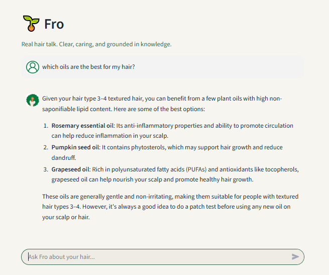
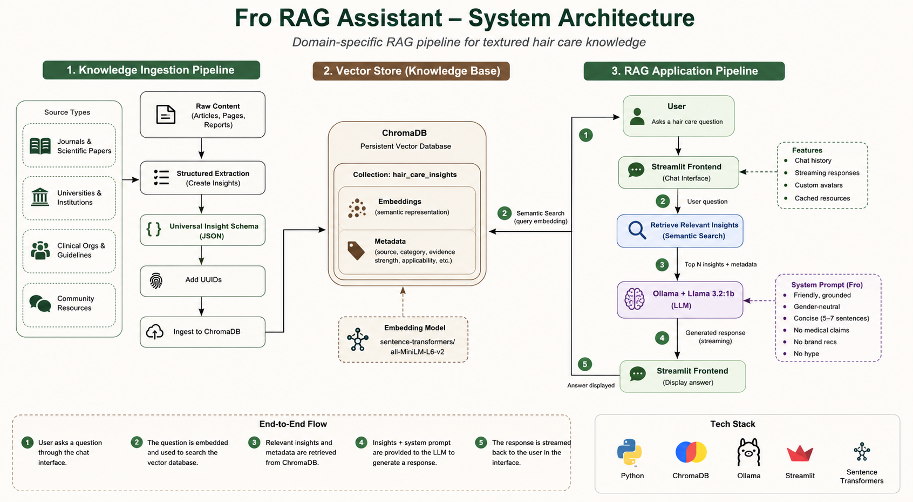

# Fro — Textured Hair Care RAG Assistant

Fro is a domain-specific retrieval-augmented generation (RAG) application designed to answer textured hair-care questions using a curated knowledge base, semantic retrieval, and a locally running language model.

The system combines structured source ingestion, ChromaDB vector search, Ollama, and a Streamlit chat interface to produce concise answers grounded in retrieved hair-care insights.



📊 **[View Project Presentation](https://www.linkedin.com/in/j-washington/overlay/1779217184980/single-media-viewer/?profileId=ACoAADzylKIByKGOYkhpFPXj47iJPxwPIWlz6tE)**

---

## Project Overview

Fro was built to explore how a domain-specific AI assistant can combine structured knowledge representation with retrieval-augmented generation.

Rather than relying only on a language model's internal knowledge, Fro retrieves relevant insights from a curated hair-care knowledge base and provides that context to the model before generating a response.

The project focuses on:

- Domain-specific RAG
- Structured knowledge ingestion
- Semantic search
- Vector databases
- Local LLM inference
- Prompt design
- Streaming conversational interfaces

---

## System Architecture



The application is divided into two main pipelines.

### Knowledge Pipeline

Public hair-care and scientific sources are converted into structured JSON records using a standardized insight schema.

Each insight can include:

- Claim
- Mechanism
- Category
- Knowledge type
- Community terminology
- Scientific mappings
- Applicability
- Evidence strength
- Confidence notes
- Source metadata

The ingestion pipeline converts each insight into semantic text and stores it in a persistent ChromaDB vector collection.

### RAG Application

When a user asks a question:

1. The question is sent to ChromaDB.
2. Relevant hair-care insights are retrieved using semantic similarity.
3. Retrieved context is combined with the Fro system prompt.
4. Ollama runs the `llama3.2:1b` model locally.
5. The response is streamed back through the Streamlit interface.

---

## Knowledge Representation

Fro uses a structured insight model rather than storing only raw article text.

Example insight fields include:

```json
{
  "uuid": "string",
  "claim": "string",
  "mechanism": "string | null",
  "category": "Hair Biology | Damage Mechanisms | Growth & Retention | Ingredients | Practices | Myths & Clarifications",
  "knowledge_type": "Scientific | Clinical | Community | Translational",
  "community_terms": ["string"],
  "scientific_mappings": ["string"],
  "applicability": "string",
  "evidence_strength": "High | Moderate | Emerging | Anecdotal",
  "confidence_notes": "string | null"
}
```

This structure separates the knowledge representation layer from the language model itself and allows information to be categorized, filtered, and retrieved more consistently.

---

## Retrieval & Vector Search

Fro uses:

**Embedding Model:** `sentence-transformers/all-MiniLM-L6-v2`  
**Vector Database:** ChromaDB

During ingestion, the semantic representation is built primarily from each insight's:

- Claim
- Mechanism

Additional attributes such as category, evidence strength, knowledge type, applicability, and source information are stored as metadata.

The project also includes a standalone semantic-search utility for testing retrieval quality independently from the chatbot.

---

## RAG Response Generation

Retrieved insights are inserted into the model context before response generation.

Fro uses:

**LLM:** `llama3.2:1b`  
**Runtime:** Ollama

The system prompt controls response characteristics such as:

- Concise responses
- Gender-neutral language
- Practical tone
- Reduced unnecessary formatting
- Avoidance of unsupported medical claims
- No brand recommendations
- No unnecessary hype or reassurance

Responses are streamed token-by-token to the Streamlit interface.

---

## Streamlit Interface

The application provides:

- Conversational chat input
- Persistent session history
- Custom user and assistant avatars
- Streaming responses
- Cached ChromaDB connection
- Cached model warm-up for improved response startup time

---

## Technologies

### AI & Retrieval
- Ollama
- Llama 3.2
- ChromaDB
- Sentence Transformers
- Retrieval-Augmented Generation

### Application
- Python
- Streamlit

### Data & Knowledge Engineering
- JSON
- Structured metadata
- UUID-based record identification
- Persistent vector storage
- Semantic retrieval

---

## Supporting Utilities

The repository includes supporting scripts for managing the knowledge pipeline:

### `add_uuids.py`

Adds persistent UUIDs to insights that do not already have identifiers.

### `ingest_sources_to_chroma.py`

Processes structured source files and ingests their insights into the ChromaDB vector database.

### `query_chroma.py`

Provides standalone semantic search for testing retrieval results and metadata filtering outside the Streamlit application.

---

## Skills Demonstrated

- Retrieval-Augmented Generation
- LLM application development
- Vector database integration
- Semantic search
- Embedding-based retrieval
- Knowledge representation
- Data ingestion pipelines
- Metadata design
- Prompt engineering
- Local model inference
- Streamlit application development
- Python modularization

---

## Project Context

Fro was developed as a personal AI engineering project exploring domain-specific RAG, structured knowledge systems, and local language-model integration.

The project emphasizes separating knowledge storage and retrieval from response generation, allowing the language model to answer questions using retrieved domain context rather than relying only on pretrained knowledge.
